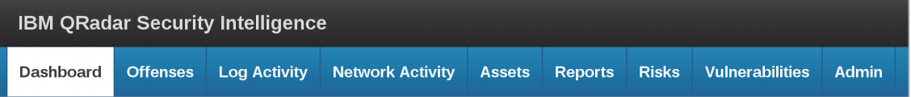
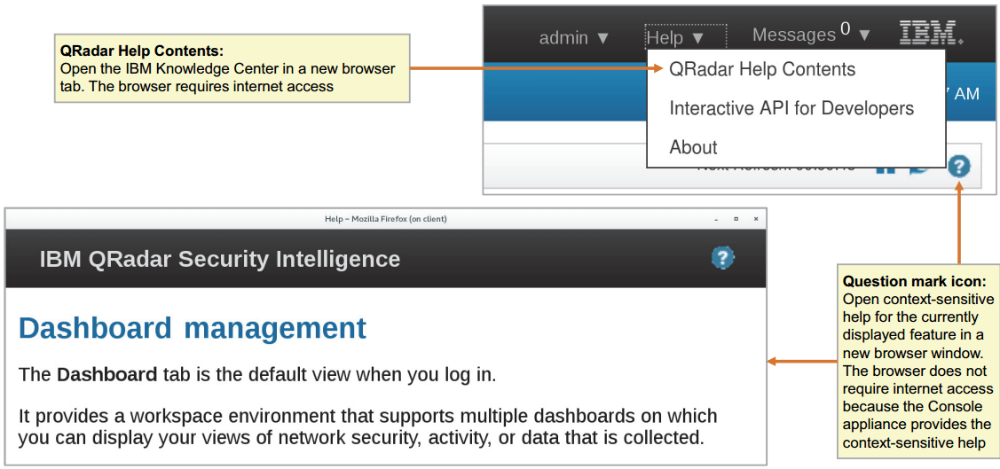

# Introduction

IBM QRadar SIEM fournit une visibilité approfondie de l'activité du réseau, des utilisateurs et des applications. Il permet la collecte, la normalisation, la corrélation et le stockage sécurisé des événements, des flux, des profils d'actifs et des vulnérabilités. QRadar SIEM classifie les attaques suspectes et les violations de politiques comme des infractions.

# Pré-requis
*  Infrastructure informatique
*  Principes fondamentaux de la sécurité informatique
*  Linux
*  Windows
*  Mise en réseau TCP/IP
*  Syslog

 
 # Objectifs pédagogiques
 
 Dans ce cours vous apprendrez à effectuer les tâches suivantes :
 * Décrire comment QRadar SIEM collecte des données pour détecter les activités suspectes
*  Décrire l'architecture du composant SIEM de QRadar et les flux de données
*  Naviguer dans l'interface utilisateur
*  Enquêter sur les attaques présumées et les violations des politiques
*  Rechercher, filtrer, regrouper et analyser les données de sécurité
*  Enquêter sur les événements et les flux
*  Enquêter sur les profils d'actifs
*  Décrivez l'objectif de la hiérarchie du réseau
*  Déterminer comment les règles testent les données entrantes et créent des infractions
*  Utiliser l'index et la gestion des données agrégées
*  Naviguer et personnaliser les tableaux de bord et les éléments du tableau de bord
*  Créer des rapports personnalisés
*  Utiliser des filtres
*  Utiliser le NQA pour les recherches avancées
*  Analyser un scénario du monde réel

# Chapitre 1: Introduction à IBM QRadar

Toute organisation doit placer une solution de renseignement de sécurité au centre de sa stratégie globale de sécurité informatique, car trop de solutions ponctuelles liées à la sécurité informatique, et le nombre toujours croissant de
sophistication des attaquants, exigent une consolidation et une analyse des événements et du trafic du réseau en temps quasi réel. Cette introduction couvre l'ensemble de l'écosystème IBM QRadar et montre comment il est ancré au centre d'un système immunitaire de sécurité global.

## Objectifs

Dans cette unité, vous apprenez à effectuer les tâches suivantes :
* Décrire pourquoi nous avons besoin de renseignements de sécurité et d'un système immunitaire de sécurité
* Décrire l'écosystème QRadar

# I. Le système immunitaire de la sécurité et pourquoi nous avons besoin du renseignement de sécurité

Il est important de comprendre les facteurs de sécurité informatique auxquels toute organisation est confrontée aujourd'hui. Le problème n'est pas seulement lié à la grande quantité d'attaques, mais aussi à l'immense diversité des méthodes utilisées pour les réaliser.
Examinons les détails suivants :
* Les facteurs de sécurité actuels
* Nombre et diversité des attentats
* Comment consolider votre renseignement de sécurité
* Le système immunitaire de sécurité d'IBM

# 1. Les facteurs de sécurité d'aujourd'hui

Toutes les organisations sont aujourd'hui confrontées à des défis similaires en matière de sécurité informatique. Les solutions informatiques doivent être faciles à utiliser et à accéder, mais la sécurisation des données et de l'accès au réseau est primordiale pour presque tous les secteurs d'activité. Examinons quelques-uns des facteurs les plus courants.

## a. Attaques avancées
La cybercriminalité va devenir un problème de 2 100 milliards de dollars d'ici 2019. Il faut aux entreprises une moyenne de
de 229 jours pour détecter les menaces persistantes avancées

## b. L'erreur humaine
Plus de la moitié des violations de données sont causées par des initiés, notamment des employés, des contractants tiers et des partenaires. Les attaques internes se produisent dans tous les secteurs et sont causées à la fois par des acteurs involontaires et par des initiés malveillants. Le secteur des services financiers a été durement touché en 2016 et a connu un pourcentage plus élevé (58 %) d'attaques d'initiés que d'attaques d'outsiders (42 %). 
Note : 53% d'acteurs involontaires et 5% d'initiés malveillants.

## c. Innovation
Les nuages, les téléphones portables et les IOT créent des risques sans précédent pour les organisations. 44 % des responsables de la sécurité s'attendent à ce qu'un grand fournisseur de services dans le nuage subisse une importante faille de sécurité à l'avenir. 33 % des organisations ne testent même pas leurs applications mobiles. CISCO estime que d'ici 2020, 50 milliards d'appareils seront connectés.

## d. Conformité
Adaptation à une approche basée sur les risques et la menace, par opposition à une approche basée sur la conformité et la vérification des cases l'approche. Le règlement général sur la protection des données (RPDP) est un nouveau cadre de protection des données qui prend effet dans toute l'Europe à partir de mai 2018. Le GDPR n'a pas seulement un impact sur les toute organisation qui stocke, consulte, traite ou utilise les données personnelles des résidents de l'UE Les données sont soumises au règlement. Les amendes pour infraction peuvent atteindre des milliards d'euros pour
les grandes entreprises mondiales - entre 2 et 4 % du revenu brut d'une entreprise

## e. Déficit de compétences
La pénurie de professionnels qualifiés dans le domaine de la cybersécurité s'aggrave, le déficit de talents prévu atteignant 1,8 million d'emplois d'ici 2022. Cette pénurie de compétences a bloqué de nombreuses entreprises : Un récent rapport de l'ISACA a révélé que 55 % des organisations ont déclaré que les cyberpostes ouverts prennent au moins trois mois à pourvoir, tandis que 32 % ont déclaré qu'ils prennent six mois ou plus. Et 27 % des entreprises américaines ont déclaré qu'elles n'étaient pas du tout en mesure de pourvoir des postes dans le domaine de la cybersécurité.

# 2. Les attaquants franchissent chaque jour les barrières de sécurité conventionnelles

Les menaces d'aujourd'hui continuent d'augmenter en nombre et en ampleur, car des attaquants sophistiqués franchissent chaque jour les barrières de sécurité conventionnelles.

Les criminels organisés, les hacktivistes, les gouvernements et les adversaires sont contraints par les gains financiers, la politique et la notoriété à s'attaquer à vos biens les plus précieux. Leurs opérations sont bien financées et s'apparentent à des activités commerciales : les attaquants évaluent patiemment les cibles en fonction de l'effort et de la récompense potentiels. Leurs méthodes sont extrêmement ciblées - ils utilisent les médias sociaux et d'autres points d'entrée pour traquer les personnes ayant accès à leurs biens, profiter de la confiance et les exploiter comme des vulnérabilités. En attendant, les employés négligents mettent involontairement l'entreprise en danger par erreur humaine. Pire encore, la sécurité Les investissements du passé peuvent ne pas protéger contre ces nouvelles classes d'attaques. Le résultat est plus les infractions graves à la sécurité sont de plus en plus fréquentes. En fait, selon le dernier rapport IBM X-Force Threat Intelligence Report, la quantité de données et la variété des attaques s'est étendue à plus de 4 milliards !

Note : La taille du cercle sur l'image indique l'impact relatif estimé.

Les cibles des cybercriminels sont désormais plus grandes et leurs récompenses plus importantes, car ils affinent leurs efforts pour obtenir et exploiter des données de plus grande valeur que les années précédentes.

La demande de fuites de données tend à s'orienter vers des dossiers de plus grande valeur tels que les informations d'identification personnelle (IIP) liées à la santé et d'autres données hautement sensibles, en mettant moins l'accent sur les courriels, les mots de passe et même les données de cartes de crédit qui étaient les cibles des années précédentes. Ces IIP peuvent être utilisées à des fins d'ingénierie sociale pour accéder à des cibles financières de valeur. On le voit à la fois dans les tendances de violation et dans l'évolution des logiciels malveillants vers des comptes bancaires de grande valeur.

Selon une étude récente de Ponemon, 201 jours est le temps moyen nécessaire aux entreprises pour identifier une brèche dans les données ; et cela coûte aux organisations américaines en moyenne 7 millions de dollars par brèche dans les données.

# 3. Comment commencer quand tout ce que je vois, c'est le chaos ?

Commençons par définir l'environnement de sécurité informatique moyen. Voici un aperçu de quelques-unes des capacités que les RSSI possèdent déjà dans leur arsenal. Ils ont acquis ces technologies différentes et dispersées au fil des ans pour relever les nombreux défis auxquels leurs environnements complexes sont confrontés. Une entreprise moyenne dispose de 85 outils provenant de 45 fournisseurs. 

Lorsque vous entamez une conversation avec eux, vous les entendez dire : "Oh oui, nous avons ça..." Ce qui est bien, mais sont-ils INTÉGRÉS ? Travaillent-ils ensemble au sein de vos multiples équipes, sites et plates-formes ? Ou bien ne font-ils qu'accroître la complexité, les risques et les coûts et, par conséquent, perdent-ils de la visibilité dans leur réseau ?

Comment un RSSI, ou franchement tout professionnel de la sécurité, peut-il avoir un aperçu et un contrôle précieux de ses environnements de sécurité alors que tout ce qu'il voit, c'est ce type de chaos épars dans les technologies qu'il utilise déjà lui-même ?

# 4. Un système immunitaire de sécurité intégré et intelligent

Nous encourageons les organisations à réfléchir à leurs impératifs de sécurité de manière plus organisée ; structurée autour de domaines logiques, et centrée sur une discipline fondamentale de l'analyse de la sécurité. Ce est rendue possible par une intelligence cognitive qui comprend, raisonne et apprend en permanence le de nombreuses variables qui affectent leur environnement et nourrissent tout l'écosystème des
capacités.

C'est là que la métaphore du système immunitaire entre vraiment en jeu, où l'on peut commencer à imaginer...

Différents organes comme couches de défense, travaillant tous ensemble pour automatiser les politiques et bloquer les menaces. Tout comme lorsque vous tombez malade, ce sont les organes qui comprennent la menace et envoient des données à travers votre système nerveux central (analyse de sécurité) pour créer des globules blancs / anticorps afin de recueillir des informations, d'établir des priorités et de prendre des mesures. C'est ce que l'on appelle la "réponse immunitaire".

Et d'ailleurs, ce n'est qu'une partie de l'histoire. Elle n'est vraiment pas totalement intégrée tant qu'elle n'est pas intégrée à l'écosystème élargi des partenaires. Une intégration qui permet la collaboration entre les entreprises et les concurrents, afin de comprendre les menaces et les données mondiales et de s'adapter aux nouvelles menaces. L'intégration peut contribuer à accroître la visibilité. Remarquez comment les capacités s'organisent autour de leurs domaines. Vous commencerez à vous faire une idée du fonctionnement de ce système immunitaire. Comme un corps qui combat un virus, il y a différentes parties d'un portefeuille de sécurité fonctionnant en même temps.

# 5. IBM security immune system portfolio

IBM offre un riche portefeuille de produits et de services qui sont organisés en trois domaines qui répondent de manière unique aux besoins des clients.

* Le premier est le domaine des opérations de sécurité et de réponse qui aide les organisations à orchestrer leurs défenses tout au long du cycle de vie des attaques.

* Le second est le domaine "Information Risk and Protection" qui aide les organisations à protéger leurs informations et leurs risques les plus critiques.

* Et le troisième est le domaine des services de transformation de la sécurité qui aide les organisations à transformer leur programme de sécurité. Toutes les offres d'IBM Security sont soutenues par un vaste écosystème de partenaires commerciaux, composé de partenaires technologiques, commerciaux et de services de premier plan.

**Opérations de sécurité et réponse**

Voici les offres clés :
* IBM X-Force Exchange : Mise à jour automatique des artefacts d'incidents grâce aux renseignements sur les menaces.
 
*  IBM App Exchange : Défendez rapidement votre organisation avec des applications et des modules complémentaires.

*  IBM BigFix : Trouver, réparer et sécuriser les menaces et les vulnérabilités des points d'accès.

*  IBM QRadar Network Security (XGS) : Prévenir les exploits du réseau et limiter les communications de logiciels malveillants.

*  IBM QRadar Security Intelligence : Utiliser des analyses avancées pour découvrir et éliminer les menaces.

*  Plateforme IBM Resilient Incident Response Platform : Générer des plans de réponse et coordonner l'activité.

*  IBM QRadar User Behavior Analytics : Aide à détecter les menaces et les risques d'initiés.

*  Services de sécurité IBM : Fournir des conseils opérationnels pour aider à la mise en œuvre des processus et des experts en matière de réaction lorsque quelque chose ne va pas.

**Risque et protection de l'information**

Voici les offres clés :

 * IBM Cloud Security : Réaliser de nouveaux investissements pour aider à sécuriser l'innovation vers et depuis le cloud.
 
 * IBM MaaS360 : La productivité mobile et la sécurité des entreprises sans compromis.
 
 * IBM Identity Governance and Access Management : Gouverner et faire respecter l'accès contextuel aux actifs critiques.
 
 * IBM Guardium : Protéger les joyaux de la couronne dans toute l'entreprise et dans le nuage.
 
 * IBM AppScan : Analyser et corriger les vulnérabilités des applications modernes.
 
 * Administrateur d'IBM : Mettre fin à la fraude financière et à l'hameçonnage, et aux prises de contrôle de comptes.
 
 * Services de sécurité IBM : Fournir des services de conseil en matière de gouvernance, de risques et de conformité, ainsi que des systèmes l'intégration et les services de sécurité gérés.
 
 
 
 **Services de transformation de la sécurité**
 
 * Stratégie de sécurité, risques et conformité: automatisez les programmes de gouvernance, de risque et de conformité.
 
 * Intelligence de sécurité et opérations: construire des opérations de sécurité et des centres de fusion de sécurité.
  
 * Évaluation et réponse en matière de cybersécurité: établir des programmes robustes de tests de sécurité et de gestion des incidents.
 
 * Gouvernance et gestion des identités: modernisez la gestion des identités et des accès à l'ère du cloud et du mobile.
 
 * Sécurité des données et des applications: déployez de solides programmes de protection des données critiques.
 
 * Sécurité de l'infrastructure et des points de terminaison: redéfinissez les solutions d'infrastructure et de points de terminaison avec des réseaux définis par logiciel sécurisés. 

# Chapitre 2: Utilisation de l'interface utilisateur du SIEM QRadar

L'interface utilisateur de QRadar SIEM est votre poste de travail pour gagner en visibilité dans votre environnement du point de vue de la sécurité. Cette leçon vous apprend comment utiliser l'interface, par exemple en faisant une pause et en actualisant les données affichées, en changeant votre mot de passe et en accédant à l'aide.

## Objectifs

Dans cette unité, vous apprenez à effectuer les tâches suivantes :
* Exploiter l'interface utilisateur SIEM de QRadar

### Les Onglets

Pour tirer parti de QRadar, utilisez ses onglets:
* Tableau de bord : Surveillez les différentes activités dans votre environnement
* Infractions : Interroger et afficher des activités suspectes
* Activité du journal : Interroger et afficher les événements
* Activité de réseau : Interroger et afficher les flux
* Actifs : Recherchez et affichez des informations sur les systèmes de votre environnement
* Rapports : Créer des modèles et générer des rapports
* Admin : Gestion du système administratif

L'interface utilisateur de QRadar SIEM propose des onglets qui vous permettent de naviguer et de vous concentrer sur des tranches spécifiques de les données collectées, analysées et affichées.
Deux autres onglets sont disponibles avec une licence pour QRadar Vulnerability and Risk Manager installé :
 - **Risks** : Recherchez et affichez les risques dans votre environnement
 - **Vulnerabilities** : Recherchez et affichez les vulnérabilités dans votre environnement
 
 
 
### Gestion des données affichées

Chaque minute le SIEM QRadar automatiquement
rafraîchit les données dans les onglets suivants:

* Dashboard
* Log Activity
* Network Activity
* Reports

.png)

Le SIEM QRadar fonctionne par cycles d'une minute. Lorsqu'un cycle d'une minute se termine, les processeurs d'événements et de flux envoient à la console les données de la minute écoulée, qui y sont nécessaires. En cliquant sur le bouton Rafraîchir, le compte à rebours affiché est remis à 60 secondes, mais les résultats renvoyés peuvent toujours provenir de la minute précédente. Le compte à rebours dans l'interface utilisateur ne fonctionne pas nécessairement en synchronisation avec le Cycles d'une minute. Le bouton Pause arrête seulement le rafraîchissement de l'affichage. Le SIEM QRadar continue de traiter les données en arrière-plan.

### Gestion de votre utilisateur QRadar

Cliquez sur votre nom d'utilisateur dans la barre supérieure pour le modifier les propriétés de votre utilisateur QRadar et pour vous déconnecter.

**Préférences de l'utilisateur**

Les utilisateurs peuvent changer leur mot de passe dans les Préférences, s'ils s'authentifient avec l'authentification du système local de QRadar SIEM. Les utilisateurs ne peuvent pas modifier le mot de passe dans les préférences utilisateur si QRadar SIEM utilise RADIUS, TACACS, Active Directory ou LDAP pour leur authentification. Dans la plupart des déploiements, l'administrateur utilisateur s'authentifie avec l'authentification du système local de QRadar SIEM, même si d'autres utilisateurs utilisent l'authentification externe. Par conséquent, l'utilisateur admin change généralement les mots de passe dans les préférences utilisateur de QRadar SIEM.

### Accéder à l'aide

